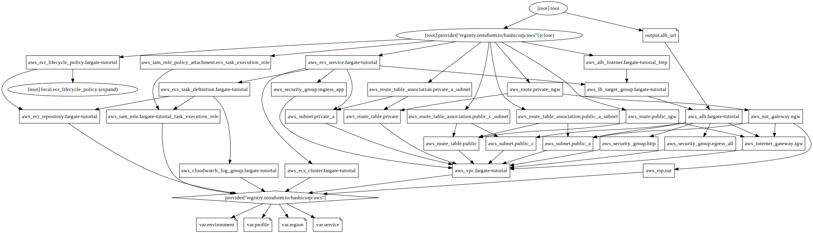

# Tutorial of AWS Fargate with Terraform

[Hello, world: The Fargate/Terraform tutorial I wish I had – Section 411](https://section411.com/2019/07/hello-world/)



## Usage

Configure your credential as `sandbox` profile:
```sh
aws configure --profile sandbox
# or
aws configure sso --profile sandbox
```

Create resources with Terraform:
```sh
pushd infra
terraform init
terraform plan -var-file=dev.tfvars -out /tmp/fargate.plan
terraform apply /tmp/fargate.plan
popd
```

Build a Docker image of the tiny Go web application:
```sh
tag=fargate-tutorial:latest
docker build -t ${tag} .
```

Push the image to the AWS ECR repository:
```sh
account_id=`aws sts get-caller-identity --profile sandbox | jq -r '.Account'`
region=ap-northeast-1
ecr_domain="${account_id}.dkr.ecr.${region}.amazonaws.com"
aws ecr get-login-password --profile sandbox | docker login --username AWS --password-stdin ${ecr_domain}
docker tag ${tag} "${ecr_domain}/${tag}"
docker push "${ecr_domain}/${tag}"
```

Access to the ALB URL with browser.

To destroy all resources:
```sh
aws ecr list-images --repository-name fargate-tutorial --profile sandbox | jq -r '.imageIds[].imageDigest' | xargs -r -I{} aws ecr batch-delete-image --repository-name fargate-tutorial --image-ids "imageDigest={}" --profile sandbox
terraform -chdir=infra destroy -var-file dev.tfvars
```
